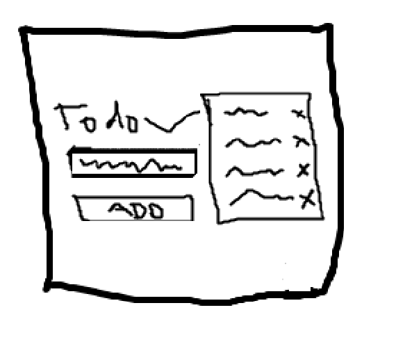

# Hyperdimensional Recursive Task Singularity

  

    
    
Comprehensive Complex Blueprint

  

  

    <h3>This repo is made to practice the following:</h3>
    <ul>
      <li>React</li>
      <li>FastAPI</li>
      <li>Prisma</li>
      <li>And more.</li>
    </ul>
  

